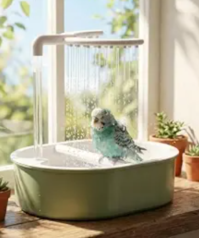

# vip-bird-spa-drizzler
a bird spa for the birds judging my cleanliness levels while dirtying their own water

A fountain/drizzler that's:
- solar because there is no power plug nearby
- need to start running early in the morning before I wake up cuz these wake up crazily early and bath the first thing (ik the level of discipline we could never)
- NO electricity anywhere near water or birds, so evth is tucked and safe
- needs me to go pick nice stones for them to build this cuz they are PICKY
- set and forget except for changing water
- work reliably even during winter and rainy days without as much sun
- splash water just a bit because they need to know it's moving water, but not as much as a human shower that can scare them

inspo:

except:
- these are wild birds and they do NOT sit in plastic or anything that looks unnatural to what they find in the wild

so that turns it into:

smth that's not a restriction:
BIRDS.

#### BOM

|Category           |Component Description                          |Purpose / Spec                                                                               |Estimated Cost (USD)|
|-------------------|-----------------------------------------------|---------------------------------------------------------------------------------------------|--------------------|
|Basin & Aesthetics |Unglazed Terracotta Plant Saucer (Wide/Shallow)|Natural porous clay surface; provides essential grip for wet bird claws and keeps water cool.|$2.00 - $4.00       |
|Basin & Aesthetics |Natural River Rocks / Pebbles                  |Placed inside the clay basin to give varied footing heights for different bird sizes.        |$0.60 - $1.20       |
|Hydraulics & Safety|R385 / R365 Diaphragm Pump                     |6V-12V DC mini pump; handles gentle circulation.                                             |$1.60 - $1.80       |
|Hydraulics & Safety|Food-Grade Silicone Tubing (2 meters)          |Routes water cleanly from the pump through a sealed dry box.                                 |$1.20               |
|Hydraulics & Safety|Sealed ABS Plastic Project Box (IP65)          |Weatherproof housing to keep all electronics safe from splashes and rain.                    |$1.80 - $3.00       |
|Power & Storage    |12V 9Ah to 12Ah LiFePO4 Battery                |Upgraded deep-cycle battery to easily handle the longer pre-dawn to dusk runtimes.           |$22.00 - $30.00     |
|Power & Storage    |30W Monocrystalline Solar Panel                |Harvests solar energy during the day to keep the system powered off-grid.                    |$11.00 - $15.00     |
|Power & Storage    |10A Solar Charge Controller (PWM/MPPT)         |Manages panel input and protects the battery from overcharging.                              |$3.00 - $5.00       |
|Control & Logic    |DC-DC Step-Down Buck Converter (LM2596)        |Steps down 12V battery power safely if lower voltage is needed.                              |$0.75 - $1.00       |
|Control & Logic    |12V Cyclic Timer Switch Module                 |Automates the schedule (e.g. turning on at 5:00 AM right when birds wake up).                |$1.80 - $3.60       |
|Tools & Wiring     |Wire Strippers & Small Screwdriver             |Stripping wire insulation and tightening component screw terminals.                          |$1.80 - $3.00       |
|Tools & Wiring     |Spool of 22 AWG Hook-up Wire (Red & Black)     |Connecting the battery, controller, timer, and pump together.                                |$1.20 - $1.80       |
|Tools & Wiring     |Wago-style Lever Connectors / Terminal Blocks  |Quick, secure, solderless wire connections.                                                  |$1.20 - $2.40       |
|Tools & Wiring     |Electrical Tape / Heat-Shrink Tubing           |Insulating exposed wire connections.                                                         |$0.60 - $1.20       |
|TOTAL              |                                               |                                                                                             |$57.35-$79.20       |
